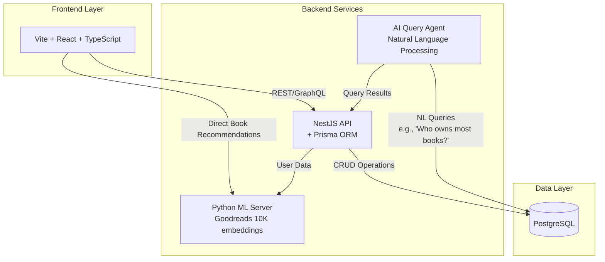

# Library-Management-System
Web application where users can manage their personal library. Users can add, edit, or delete books, organize them by genre, and track their reading status. An admin user will have the authority to manage all books and users.

---
### Core:

### DB and Vector Store:

### Infrastructure:

---

# Architecture overview

---  

## Core Components
Frontend: Modern React application with TypeScript, built with Vite

Backend API: NestJS framework with Prisma ORM for database operations

ML Service: Python-based recommendation engine using Goodreads embeddings

AI Query Agent: Processes natural language admin queries with database verification

Database: PostgreSQL for persistent storage

## Key Features

Personal library management (books, genres, reading status)

Admin management capabilities

Direct ML-powered book recommendations

Natural language querying for admin analytics

Infrastructure
Docker Compose for service orchestration
